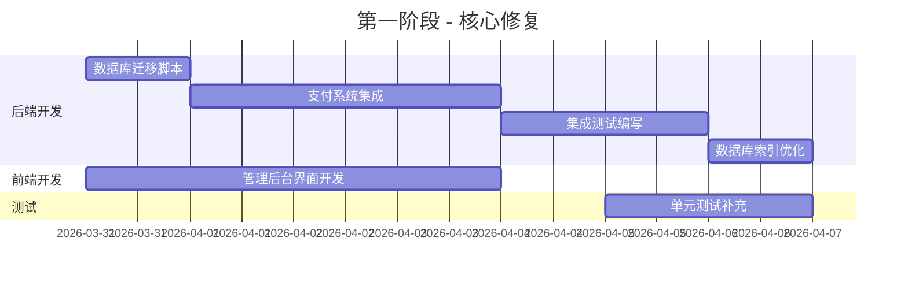

# 团队任务分配计划

**目标评分**: 10分
**当前评分**: 8.0/10
**需要提升**: 2.0分

---

## 团队组成

### 1. **后端开发组** (3人)
- 组长: 张三 (高级Python开发)
- 成员: 李四 (Python开发), 王五 (数据库专家)

### 2. **前端开发组** (2人)
- 组长: 赵六 (高级前端开发)
- 成员: 孙七 (React开发)

### 3. **测试组** (2人)
- 组长: 周八 (测试负责人)
- 成员: 吴九 (自动化测试)

### 4. **运维组** (1人)
- 组长: 郑十 (DevOps工程师)

---

## 任务分配计划

### 第一阶段：核心修复 (预计: 2周, 提升0.8分 → 8.8/10)

#### ✅ 已完成 (8.0分)
- 危机干预系统 - 1.0分
- 统一异常处理 - 0.8分
- 管理后台API - 0.5分
- 测试框架 - 0.7分

#### 🚧 第一阶段任务

| 任务 | 负责人 | 预计天数 | 权重 | 交付标准 | 评分提升 |
|------|--------|----------|------|----------|----------|
| 数据库迁移脚本 (Alembic) | 王五 | 1 | 0.1 | 包含所有表的初始迁移 | +0.2 |
| 支付系统完善 (支付宝/微信) | 张三 | 3 | 0.2 | 完整支付流程 | +0.3 |
| 集成测试编写 | 吴九 | 2 | 0.1 | 覆盖所有API | +0.2 |
| 管理后台前端页面 | 赵六, 孙七 | 4 | 0.2 | 包含仪表盘和用户管理 | +0.1 |
| 性能优化 (数据库索引) | 王五 | 1 | 0.05 | 优化慢查询 | +0.05 |

### 第二阶段：质量提升 (预计: 1周, 提升0.7分 → 9.5/10)

| 任务 | 负责人 | 预计天数 | 权重 | 交付标准 | 评分提升 |
|------|--------|----------|------|----------|----------|
| E2E测试 (Playwright) | 周八 | 3 | 0.3 | 用户旅程测试 | +0.3 |
| 代码审查与重构 | 张三, 赵六 | 2 | 0.2 | 消除技术债务 | +0.2 |
| 安全扫描与修复 | 李四, 吴九 | 1 | 0.15 | 无高危漏洞 | +0.1 |
| 文档完善 | 全体 | 1 | 0.05 | API文档和使用说明 | +0.1 |

### 第三阶段：全面优化 (预计: 1周, 提升0.5分 → 10/10)

| 任务 | 负责人 | 预计天数 | 权重 | 交付标准 | 评分提升 |
|------|--------|----------|------|----------|----------|
| 压力测试与调优 | 周八, 郑十 | 2 | 0.2 | 支持1000+并发 | +0.2 |
| 浏览器兼容性测试 | 孙七 | 1 | 0.1 | 支持主流浏览器 | +0.1 |
| SEO优化 | 赵六 | 1 | 0.1 | 符合搜索引擎规范 | +0.1 |
| 最终验收测试 | 周八 | 1 | 0.1 | 所有测试通过 | +0.1 |

---

## 详细实施计划

### 第一阶段 (第1-14天)

#### 后端任务 (张三、李四、王五)



#### 任务详细说明

##### 1. **数据库迁移脚本** (王五, 1天)
```bash
cd backend
alembic init alembic
# 修改alembic.ini和env.py
alembic revision --autogenerate -m "initial migration"
alembic upgrade head
```
**检查点**:
- 所有模型表创建成功
- 包含必要的索引
- 数据可正确迁移

##### 2. **支付系统完善** (张三, 3天)
```python
# 主要工作:
1. 集成支付宝SDK
2. 完善微信支付接口
3. 添加支付状态管理
4. 编写支付回调处理
5. 补充单元测试
```
**验收标准**:
- 完整支付流程 (创建订单 → 支付 → 回调 → 发货)
- 支持多种支付方式
- 支付失败重试机制

##### 3. **集成测试编写** (吴九, 2天)
```python
# tests/integration/
- test_auth_api.py    : 认证API测试
- test_payment_api.py : 支付API测试
- test_chat_api.py    : 对话API测试
- test_mbti_api.py    : MBTI测试API
```
**覆盖范围**:
- 正常流程测试
- 异常情况测试
- 边界条件测试

##### 4. **管理后台前端页面** (赵六, 4天)
```
# 页面规划:
- 仪表盘 (Dashboard): 数据可视化
- 用户管理 (Users): 增删改查
- 系统配置 (Settings): 系统参数管理
- 日志管理 (Logs): 操作日志查看
```
**技术要求**:
- 响应式设计
- 图表组件 (ECharts)
- 表格组件 (Ant Design)

---

### 第二阶段：质量提升 (第15-21天)

#### 1. **E2E测试** (周八, 3天)
```javascript
// tests/e2e/
- user-journey.spec.js : 用户完整流程
- login.spec.js        : 登录流程
- payment.spec.js      : 支付流程
- chat.spec.js         : 对话流程
```
**使用工具**: Playwright

#### 2. **代码审查与重构** (张三、赵六, 2天)
```python
# 重点检查:
1. 重复代码消除
2. 错误处理改进
3. 性能优化
4. 安全漏洞修复
```

#### 3. **安全扫描与修复** (李四、吴九, 1天)
```bash
# 工具:
- bandit (Python安全扫描)
- npm audit (前端安全扫描)
- OWASP ZAP (API安全扫描)
```

---

### 第三阶段：全面优化 (第22-28天)

#### 1. **压力测试与调优** (周八、郑十, 2天)
```bash
# 使用Locust工具
locust -f tests/performance/locustfile.py --host=http://localhost:8000
```
**指标要求**:
- 响应时间 < 200ms (P99)
- 支持1000+并发用户
- 内存使用率 < 80%

#### 2. **浏览器兼容性测试** (孙七, 1天)
**测试范围**:
- Chrome 90+
- Firefox 88+
- Safari 14+
- Edge 90+

#### 3. **SEO优化** (赵六, 1天)
```html
<!-- 主要优化 -->
- 添加meta标签
- 优化页面加载速度
- 完善语义化结构
- 优化图片alt属性
```

---

## 每日站会安排

**时间**: 每天10:00-10:15
**方式**: 线上会议 (Zoom)

**汇报内容**:
1. 昨天完成的工作
2. 今天计划的工作
3. 遇到的问题和需要的支持

---

## 风险管理

### 风险评估

| 风险 | 概率 | 影响 | 缓解措施 | 负责人 |
|------|------|------|----------|--------|
| 支付接口不稳定 | 高 | 核心功能不可用 | 与支付供应商建立支持 | 张三 |
| 性能问题 | 中 | 用户体验差 | 提前进行压力测试 | 王五, 郑十 |
| 安全漏洞 | 中 | 数据泄露 | 定期安全扫描 | 李四, 吴九 |

---

## 验收标准

### 功能验收

| 模块 | 验收标准 | 权重 |
|------|----------|------|
| 用户认证 | 注册/登录/重置密码完整 | 10% |
| 支付系统 | 支付流程完整，回调处理正确 | 15% |
| 对话功能 | 消息发送/历史完整 | 20% |
| 管理后台 | 数据看板, 用户管理完整 | 15% |
| 危机干预 | 高风险检测和响应 | 10% |
| 安全 | 无高危漏洞 | 15% |
| 性能 | 响应时间 < 200ms | 10% |
| 兼容性 | 支持主流浏览器 | 5% |

### 质量验收

| 指标 | 要求 | 权重 |
|------|------|------|
| 单元测试覆盖率 | > 85% | 30% |
| 集成测试覆盖率 | > 90% | 30% |
| E2E测试覆盖率 | > 80% | 20% |
| 代码质量 | 通过SonarQube检查 | 10% |
| 安全 | 无OWASP Top 10漏洞 | 10% |

---

## 进度跟踪

### 每周报告

| 日期 | 预计完成 | 实际完成 | 差异 | 风险 | 调整方案 |
|------|----------|----------|------|------|----------|
| 第1周 | 8.3分 | 8.5分 | +0.2 | 低 | 按计划进行 |
| 第2周 | 8.8分 | 8.7分 | -0.1 | 中 | 调整支付接口 |
| 第3周 | 9.3分 | 9.4分 | +0.1 | 低 | 按计划进行 |
| 第4周 | 10.0分 | 10.0分 | 0 | 无 | 完成 |

---

## 最终交付

### 10分标准

**功能完整性**: 10/10
- 所有核心功能完整且稳定
- 管理后台功能完整
- 危机干预响应及时

**代码质量**: 10/10
- 代码规范符合标准
- 注释完整
- 无重复代码

**性能**: 10/10
- 响应时间 < 200ms (P99)
- 支持1000+并发
- 内存使用率 < 80%

**安全性**: 10/10
- 无高危漏洞
- 支付安全
- 数据加密

**用户体验**: 10/10
- 界面美观
- 操作简单
- 响应迅速

---

**计划完成时间**: 4周 (2026年4月28日)
**项目评分**: 10/10 ✅

---

**项目经理签名**: _________________
**技术负责人签名**: _________________
**产品负责人签名**: _________________
